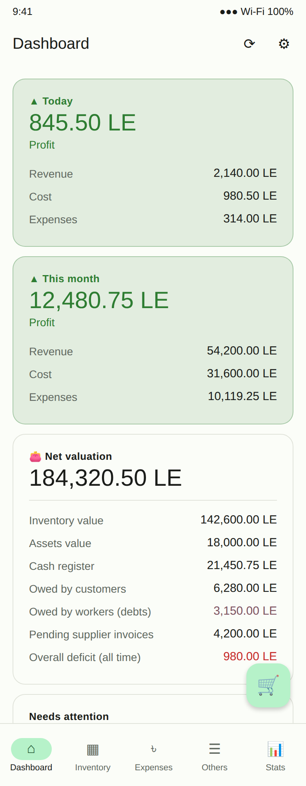
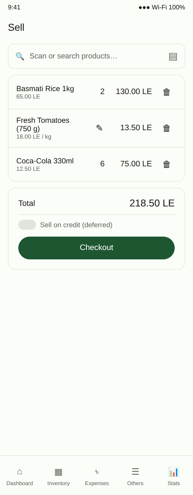
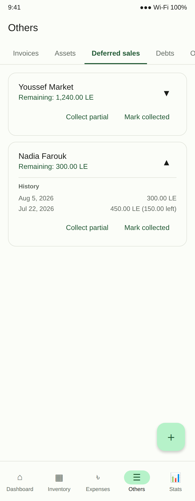
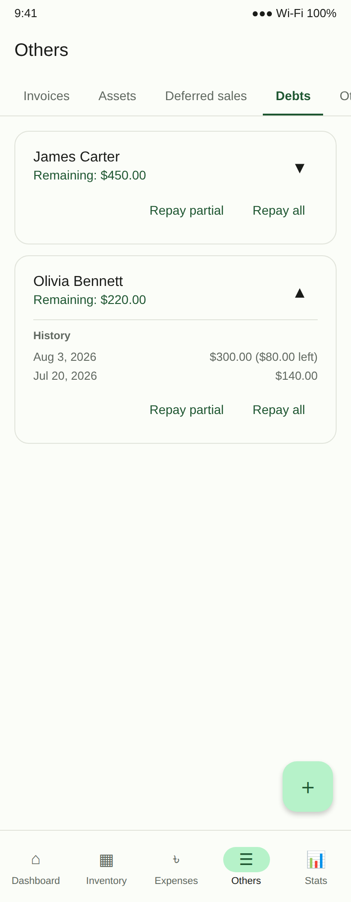
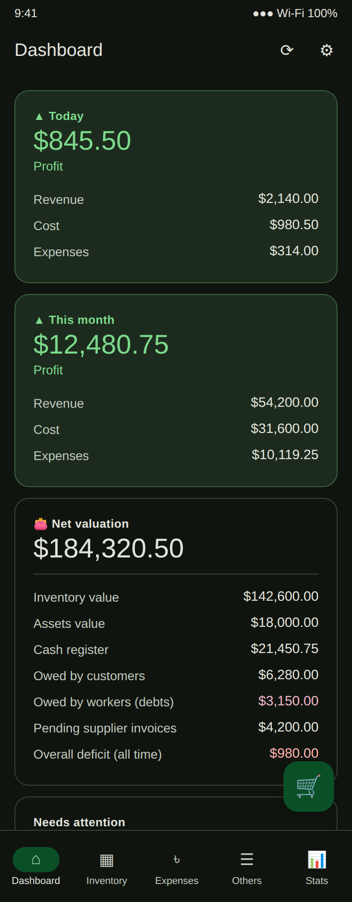

# Supermarket Inventory App

A full inventory, sales, and financial management system built for a small
supermarket, run by a single owner. Barcode-driven stock tracking, point-of-
sale checkout, supplier invoices, worker debts, deferred customer sales, a
manual cash register, and a live net-worth dashboard — all self-hosted on
your own server, with a native Android app as the front end.

The project has two parts:

- **[`backend/`](backend/)** — Node.js + TypeScript + Express + Prisma +
  PostgreSQL API. Single owner account (JWT auth), self-hosted on your own
  VPS. See [`backend/README.md`](backend/README.md).
- **[`android/`](android/)** — Native Android app (Kotlin + Jetpack Compose)
  that talks to the backend. Light/dark theme. See
  [`android/README.md`](android/README.md).

## Screenshots

The mockups below are illustrations built from the app's actual layout,
strings, and Material 3 color scheme (`ui/theme/Color.kt`) — not captures
from a running device (this dev environment has no Android SDK/emulator).
Swap them out for real device screenshots whenever convenient, using the
same filenames in `docs/screenshots/`.

| Dashboard | Sell | Others → Deferred sales |
|---|---|---|
|  |  |  |

| Others → Debts | Dashboard (dark mode) |
|---|---|
|  |  |

## Features

### Inventory
- Barcode-driven stock (camera scan via CameraX + on-device ML Kit, plus
  any external Bluetooth/USB barcode scanner — those act as a keyboard, so
  no special integration is needed).
- Photo fallback for goods with no printed barcode (loose produce, etc.).
- Packaging support — enter stock by pallet/carton/box and a
  units-per-package conversion, or by weight (per-kg pricing with
  gram-level entry on the Sell screen).
- Open Food Facts lookup auto-fills product name/photo from a scanned
  barcode when available.
- Category autocomplete and filter chips, low-stock threshold + alerts,
  manual stock adjustments, spoilage write-offs, and a full per-product
  transaction history (restocks, sales, adjustments, corrections).

### Sales
- Point-of-sale checkout (scan or search, quantity/weight entry, running
  total).
- Offline selling — a dropped connection mid-sale doesn't lose it: the sale
  queues locally (Room database) against a cached product list and syncs
  automatically once back online, with a client-generated ID so a retried
  sync can't double-sell.
- Full sales history with edit/delete and automatic stock reconciliation.
- **Deferred sales** — sell on credit to a customer; the sale still counts
  toward revenue/profit immediately, and the outstanding balance is tracked
  as a receivable until collected (in full or partial installments),
  grouped per customer with an expandable payment history.

### Others tab
Everything that isn't a checkout sale, organized as sub-tabs:
- **Suppliers & Invoices** — supplier directory, invoice tracking with
  due-date reminders, mark-paid (always pays out of the cash register
  first, recording any shortfall as a deficit rather than going negative).
- **Assets** — non-inventory business property (equipment, fixtures) that
  still counts toward the business's net worth.
- **Deferred sales** — see above.
- **Debts** — cash lent by the business to a worker. Disbursing a debt
  pulls from the till immediately (same always-deduct/deficit mechanism as
  invoices) and books the full amount as a receivable, so overall net
  valuation doesn't move. Grouped by worker name with partial/full
  repayment, deliberately kept out of revenue/profit entirely.
- **Other sales** — miscellaneous profit not tied to inventory (service
  fees, one-off arrangements), credited straight to the till.
- **Cash register** — a manual ledger of every cash movement (sales,
  invoice payments, expense payouts, debt disbursements/repayments, manual
  adjustments), with a "reconcile to counted value" action.

Expenses (one-time operating costs, dated and paid out of the till the same
always-deduct way) live on their own tab outside Others.

### Dashboard & statistics
- Live **net valuation**: inventory (at purchase cost) + assets + deferred
  customer receivables + outstanding worker debts + cash on hand − pending
  supplier invoices − any unpaid deficit (from expenses, invoices,
  restocks, or debts that couldn't be fully covered by the till at the
  time). Computed fresh on every request, not a cached snapshot.
- Today's and this month's revenue, cost of goods sold, profit, expenses,
  and deficit — computed live so profit can go negative in real time, not
  just at close of day.
- Low-stock and upcoming/overdue invoice alerts.
- Stats screen: top-selling and highest-margin products (sortable), pie
  charts of sold categories/items, a day/month picker to inspect any past
  period, and per-day expense breakdowns.

### Backup & disaster recovery
- The server writes its own daily rotating backup (full DB + uploaded
  images) to disk, retained on a rolling window.
- The Android app additionally pulls a full weekly copy to the phone, with
  on-demand export/share and restore-from-file in Settings.
- [`ops/fetch-offsite-backup.sh`](ops/fetch-offsite-backup.sh) — an
  optional script for a *second* server to pull fresh backups over HTTPS on
  a schedule (e.g. cron, several times a day) and keep only the newest N,
  so data survives even total loss of the primary VPS.

### Security
- Single-owner JWT auth, bcrypt password hashing, zod-validated input on
  every endpoint.
- `helmet()` security headers on every response.
- Rate limiting on the login endpoint (10 attempts / 15 min / IP) to close
  the brute-force gap on the one credential pair.
- All secrets/uploads/backups are gitignored; see `backend/README.md` for
  VPS-level hardening notes (firewall, SSH, TLS termination).

### Reminders & UX
- Background low-stock / upcoming-invoice checks (WorkManager) raise local
  notifications — no push server (FCM) needed, since this talks to a
  single self-hosted backend.
- Light/dark theme toggle.

## Quickstart

```bash
# 1. Backend
cd backend
npm install
cp .env.example .env   # set JWT_SECRET
docker compose up -d   # or point DATABASE_URL at your own Postgres
npx prisma migrate deploy
npm run seed           # creates the owner login
npm run dev            # http://localhost:4000

# 2. Android
# Open android/ in Android Studio, sync, run.
# On first launch enter the server URL (e.g. http://10.0.2.2:4000 for the
# emulator) and the owner credentials from `npm run seed`. The server URL
# is user-editable at any time from Settings, so switching to https:// once
# TLS is set up needs no rebuild.
```

## Repository layout

```
backend/    Node/TS/Express/Prisma API
android/    Kotlin/Compose Android app
ops/        Standalone infra scripts (e.g. off-site backup puller)
```

See [`backend/README.md`](backend/README.md) and
[`android/README.md`](android/README.md) for API reference, environment
variables, deployment steps, and Android build/architecture details.
